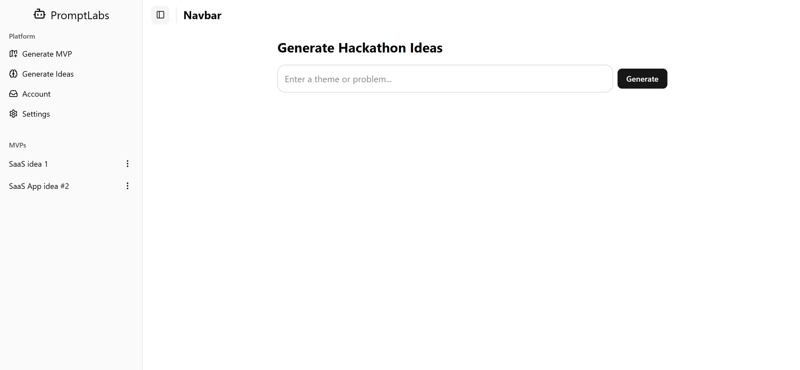

# promptlabs

# About
<h2> Spend less time planning and spend more time hacking! </h2>

# Install
## Frontend
Install dependencies: `npm i`
Start frontend: `npm run dev`

## Backend
### create venv
py -m venv .venv
### activate venv
.venv\Scripts\activate

### install dependencies
pip install -r requirements.txt

### uvicron
uvicorn main:app
### uvicorn with reload
uvicorn main:app --reload